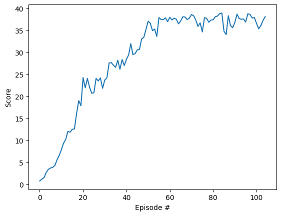

# Introduction

For this project, The goal is to train an agent using the Reacher environment, one of the Unity environments described here: [Reacher](https://github.com/Unity-Technologies/ml-agents/blob/master/docs/Learning-Environment-Examples.md#reacher) environment.

![Trained Agent][image1]

In this environment, a double-jointed arm can move to target locations. A reward of +0.1 is provided for each step that the agent's hand is in the goal location. Thus, the goal of your agent is to maintain its position at the target location for as many time steps as possible.

The observation space consists of 33 variables corresponding to position, rotation, velocity, and angular velocities of the arm. Each action is a vector with four numbers, corresponding to torque applicable to two joints. Every entry in the action vector should be a number between -1 and 1.

There are two separate versions of the Unity environment:
- The first version contains a single agent.
- The second version contains 20 identical agents, each with its own copy of the environment.  

# Learning Algorithm

In this environment we have a continuous state space, but different from the previous project we have also a continuous action space. This means that we can not longer use value based algorithms such as DQN as before, and some Policy Gradient algorithm is required. 
From the different alternatives for Policy Gradient algorithms, I initially tried to implement Proximal Policy Optimization (PPO), based on the exercises in the lessons, but after reading the DDPG paper, I though it will be easier to implement using previous project code, as it is an evolution of the DQN algorithm for continuous action space environments.

In DDPG there are two function aproximators (implemented using Deep Neural Networks) like in Actor Critic algorithms, one to aproximate the policy (the actor), and another one to aproximate the value function (the critic). But in this case the policy learned is not stochastic, but deterministic. Being determistic allows as to reuse experiences from the past as with the DQN algorithm and train with samples from a replay bufffer, but this requires to add some noise to actor output to force environment exploration:

The simplest method to add noise is just to add the random normal distribution, but there is a  very popular in the financial world
and other domains dealing with stochastic processes: OU processes. This process models the velocity of the massive Brownian particle under the
influence of the friction and is defined by this stochastic differential equation:

∂xt = θ(µ − xt )∂t + σ∂W , 

here θ, µ, σ are parameters of the process and Wt is the Wiener process. In a discrete-time case, the OU process could be written as
x t +1 = x t + θ(µ − x t ) +σ N . This equation expresses the next value generated by the process via the previous value of the noise, adding normal noise N.

The actor network with this added noise function is used to gather experiences in the environment that are stored in a replay buffer, and then every few steps we can train the policy function approximator and the value function aproximator using samples from that replay buffer. This training loop is very similar to the DQN algorithm.


## Neural Network Model Architecture

The Actor architecture has two hidden layers and the input and output layers, the number of features of each hidden layer is taken from the hyper parameters yaml file.
The activation Tanh function in the end ensures that the output domain is [-1, 1], which could scaled with OUTPUT parameter. This was used to test the algorithm implementation the pendulum environment which is anothe continuous space environment, but more simple and the output domain is [-2, 2].

```
Actor(                                                                                                                                                
  (model): Sequential(                                                                                                                                
    (0): Linear(in_features=33, out_features=HIDDEN_1, bias=True)                                                                                          
    (1): ReLU()                                                                                                                                       
    (2): Linear(in_features=HIDDEN_1, out_features=HIDDEN_2, bias=True)                                                                                          
    (3): ReLU()                                                                                                                                       
    (4): Linear(in_features=HIDDEN_2, out_features=4, bias=True)                                                                                            
    (5): Tanh()                                                                                                                                       
  )                                                                                                                                                   
)      
```


The Critic network has two branches, the first one is the observation branch (obs_net) and the other is the action branch (a_net) that only have one hidden layer each. Then both are joined in a common branch (q_net) which has two more hidden layers. As before, the number of features of each hidden layer is taken from the hyper parameters yaml file. There is no activation function at the end, as usual for value function aproximation.

```
Critic(                                                                                                                                               
  (obs_net): Sequential(                                                                                                                              
    (0): Linear(in_features=33, out_features=CRITIC_OBS_HIDDEN_1 bias=True)                                                                                          
    (1): ReLU()                                                                                                                                       
  )                                                                                                                                                   
  (a_net): Sequential(                                                                                                                                
    (0): Linear(in_features=4, out_features=CRITIC_ACT_HIDDEN_1, bias=True)                                                                                            
    (1): ReLU()                                                                                                                                       
  )                                                                                                                                                   
  (q_net): Sequential(                                                                                                                                
    (0): Linear(in_features=CRITIC_OBS_HIDDEN_1 + CRITIC_ACT_HIDDEN_1, out_features=CRITIC_HIDDEN_2, bias=True)                                                                                          
    (1): ReLU()                                                                                                                                       
    (2): Linear(in_features=CRITIC_HIDDEN_2, out_features=CRITIC_HIDDEN_3, bias=True)                                                                                           
    (3): ReLU()                                                                                                                                       
    (4): Linear(in_features=CRITIC_HIDDEN_3, out_features=1, bias=True)                                                                                            
  )                                                                                                                                                   
)   
```

I started with fewer hidden layers, and I found that the agent took very long to converge, so I started adding more features and hidden layers until I started to see improvements.

As with DQN, both actor and critic networks are duplicated in target networks, and local networks. The Local networks are used for training, and the target networks to produce stable targets to train previous networks. Every train step the target networks weights are "soft" updated with the local network weights. This is to have stable targets in the training, so it can converge. 

The loss function to optimize the critic network is similar to the DQN, similar to a Mean Square Error loss but less sensitive to outliers. The target actor and critic networks are used to compute future rewards:

```
target = rewards + gamma * self.critic_target(next_states, self.actor_target(next_states)) * (1 - dones)                                      
critic_loss = F.smooth_l1_loss(self.critic_local(states,actions), target.detach())       
```

The loss function of the actor network is simply the value function, negated to maximize it in the optimization step:

```
actor_loss = -self.critic_local(states, self.actor_local(states)).mean()
```

The optimizer used in both networkss is the Adam optimizer with a learning rate that is taken from the parameters yaml file

```
Episode 100 	Average Score: 28.32
Episode 105 	Average Score: 30.06
Environment solved in 105 episodes!	Average Score: 30.06
```

## Hyper Parameters

The hyper parameters used in the final training loop are stored in the parameters.yaml file:

```
        BUFFER_SIZE : 100000     # replay buffer size.
        BATCH_SIZE : 256         # minibatch size
        GAMMA : 0.99             # discount factor
        TAU : 0.01               # for soft update of target parameters
        ACTOR_LR : 0.001         # learning rate for Actor network
        ACTOR_HIDDEN_1: 128      # Number of features of hidden layer 1 of Actor NN
        ACTOR_HIDDEN_2: 64       # Number of features of hidden layer 2 of Actor NN
        CRITIC_LR : 0.001        # learning rate for Critic network
        CRITIC_OBS_HIDDEN_1: 128 # Number of features of hidden layer 1 of Critic NN (observation branch)
        CRITIC_ACT_HIDDEN_1: 64  # Number of features of hidden layer 1 of Critic NN (actions branch)
        CRITIC_HIDDEN_2: 64      # Number of features of hidden layer 2 of Critic NN (common branch)
        CRITIC_HIDDEN_3: 32      # Number of features of hidden layer 3 of Critic NN (common branch)
        SIGMA: 0.01              # noise generator sigma parameter
        THETA: 0.15              # noise generator theta parameter        
        UPDATE_EVERY : 10        # how often to update the network
        K : 16                   # times to train each update
        OUT_SCALE : 1.0          # scale of actions domain. In this case actions are [-1,1]
```

## Plot of rewards 

This is the average plot rewards:



It usually takes around 100 episodes to solve the environment:

```
Episode 100 	Average Score: 28.32
Episode 105 	Average Score: 30.06
Environment solved in 105 episodes!	Average Score: 30.06
```
### Future ideas

In the future I would like to use other Policy Gradient algorithms like A3C to compare with DDPG performance. Other ideas is to use different activation function in the networks, like ELU or SELU which seems to have better properties than RELU, or some normalization or dropout layers to improve the learning process.

